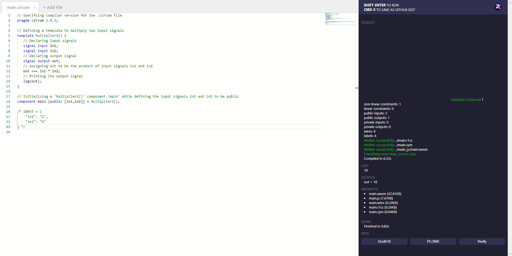
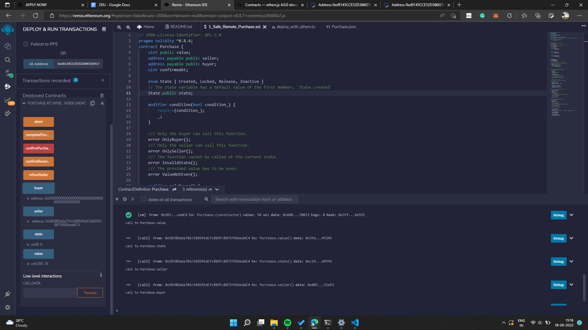
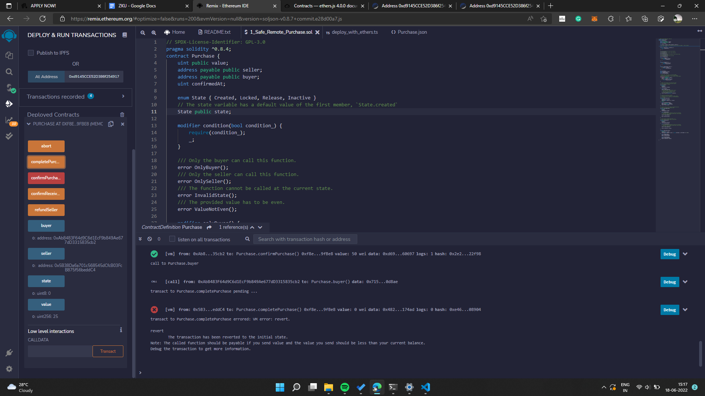
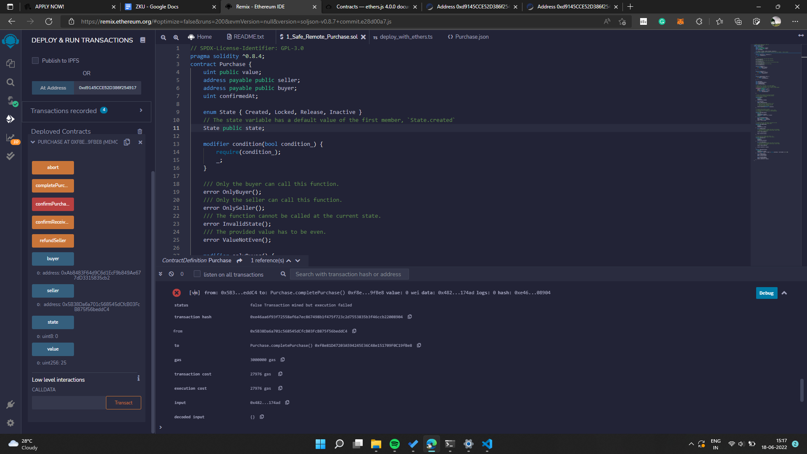
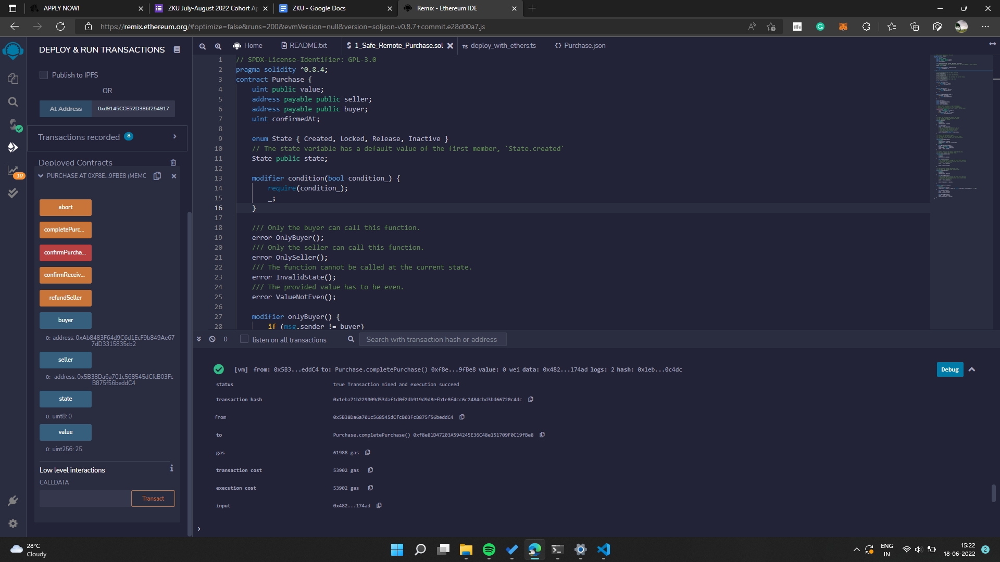

# zku.ONE

## Background Assignment
### Circuits
```circom
// Specifying compiler version for the .circom file 
pragma circom 2.0.3;

// Defining a template to multiply two input signals
template Multiplier2() {
   // Declaring input signals
   signal input in1;
   signal input in2;
   // Declaring output signal
   signal output out;
   // Assigning out to be the product of input signals in1 and in2 
   out <== in1 * in2;
   // Printing the output signal
   log(out);
}

// Initializing a 'Multiplier2()' component 'main' while defining the input signals in1 and in2 to be public
component main {public [in1,in2]} = Multiplier2();

/* INPUT = {
    "in1": "2",
    "in2": "9"
} */

```


### Smart Contracts
#### Safe Remote Purchase
```solidity
// SPDX-License-Identifier: GPL-3.0
pragma solidity ^0.8.4;
contract Purchase {
    uint public value;
    address payable public seller;
    address payable public buyer;
    uint confirmedAt;

    enum State { Created, Locked, Release, Inactive }
    // The state variable has a default value of the first member, `State.created`
    State public state;

    modifier condition(bool condition_) {
        require(condition_);
        _;
    }

    /// Only the buyer can call this function.
    error OnlyBuyer();
    /// Only the seller can call this function.
    error OnlySeller();
    /// The function cannot be called at the current state.
    error InvalidState();
    /// The provided value has to be even.
    error ValueNotEven();

    modifier onlyBuyer() {
        if (msg.sender != buyer)
            revert OnlyBuyer();
        _;
    }

    modifier onlySeller() {
        if (msg.sender != seller)
            revert OnlySeller();
        _;
    }

    modifier inState(State state_) {
        if (state != state_)
            revert InvalidState();
        _;
    }

    event Aborted();
    event PurchaseConfirmed();
    event ItemReceived();
    event SellerRefunded();

    // Ensure that `msg.value` is an even number.
    // Division will truncate if it is an odd number.
    // Check via multiplication that it wasn't an odd number.
    constructor() payable {
        seller = payable(msg.sender);
        value = msg.value / 2;
        if ((2 * value) != msg.value)
            revert ValueNotEven();
    }

    /// Abort the purchase and reclaim the ether.
    /// Can only be called by the seller before
    /// the contract is locked.
    function abort()
        external
        onlySeller
        inState(State.Created)
    {
        emit Aborted();
        state = State.Inactive;
        // We use transfer here directly. It is
        // reentrancy-safe, because it is the
        // last call in this function and we
        // already changed the state.
        seller.transfer(address(this).balance);
    }

    /// Confirm the purchase as buyer.
    /// Transaction has to include `2 * value` ether.
    /// The ether will be locked until confirmReceived
    /// is called.
    function confirmPurchase()
        external
        inState(State.Created)
        condition(msg.value == (2 * value))
        payable
    {
        emit PurchaseConfirmed();
        buyer = payable(msg.sender);
        confirmedAt = block.timestamp;
        state = State.Locked;
    }

    /// Confirm that you (the buyer) received the item.
    /// This will release the locked ether.
    function confirmReceived()
        external
        onlyBuyer
        inState(State.Locked)
    {
        emit ItemReceived();
        // It is important to change the state first because
        // otherwise, the contracts called using `send` below
        // can call in again here.
        state = State.Release;

        buyer.transfer(value);
    }

    /// This function refunds the seller, i.e.
    /// pays back the locked funds of the seller.
    function refundSeller()
        external
        onlySeller
        inState(State.Release)
    {
        emit SellerRefunded();
        // It is important to change the state first because
        // otherwise, the contracts called using `send` below
        // can call in again here.
        state = State.Inactive;

        seller.transfer(3 * value);
    }

    function completePurchase()
        external
        inState(State.Locked)
        condition(msg.sender == buyer || block.timestamp - confirmedAt >= 5 * 60)
    {
        emit ItemReceived();
        state = State.Release;
        buyer.transfer(value);

        emit SellerRefunded();
        state = State.Inactive;
        seller.transfer(3 * value);
    }
}
```
##### Contract Deployed

##### Purchase Confirmed

##### Seller Fails

##### Seller Succeeds


## Links
[Background Assignment](https://docs.google.com/document/d/1EkelvfHdveddZ-wVLX-jiOMCK3NhqEi6NvF9pnCX_2o/edit?usp=sharing)
